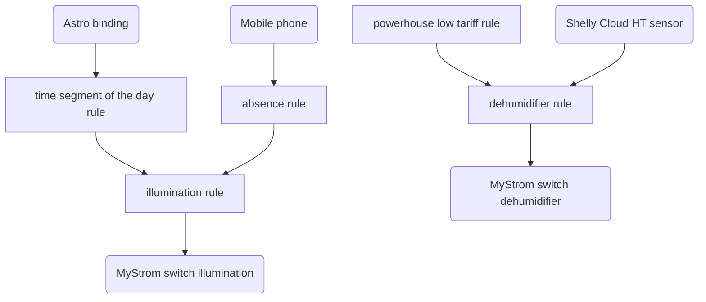

# Lightweight Openhab on a raspberrypi 3b

## Add-ons

- Network Binding
- HTTP Binding
- MQTT Binding
- Astro Binding
- rrd4j Persistence (-> set as default)
- Embedded MQTT Broker
- JSONPath Transformation

## Installations on RPI

- Raspbian Buster Lite
- openhab
- java

## Additional informations

- In top foleder is a script to automatic copy the openhab files to RPI (file: autocopy)
- Set time on RPI

## Information Flow

## ToDo

- Telegram message
- LaMetric
- Add moving average filter for dehumidifier
- Two channel chart?
